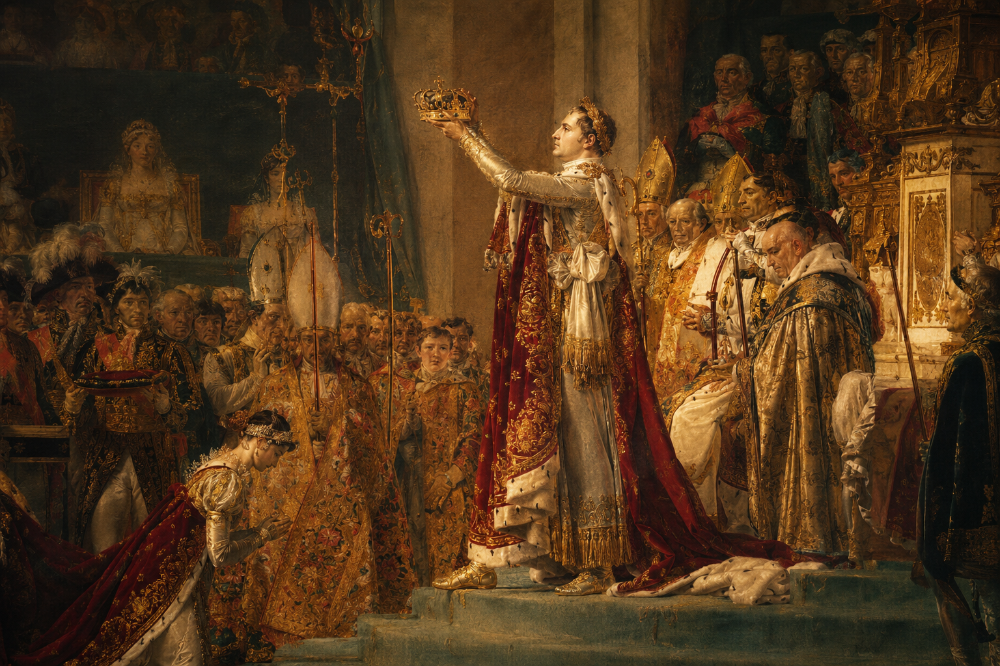

# ⚔️ 拿破仑：法兰西的荣光与倾覆 (Napoleon: Glory & Fall of the French Empire)

> **专为马来西亚华文独中《初二历史》课程设计！亲临拿破仑时代的欧洲，掌握帝国的命运。**

## 🎮 [👉 点击这里：立即在线试玩！](https://chewyenhan.github.io/Napoleon_Empire/)
*(无需下载，直接在浏览器中开启历史之旅)*



## 🎓 教学适配：马来西亚独中初二历史
本项目紧扣**马来西亚华文独立中学初二历史**教材中关于"拿破仑时代"的考点，通过沉浸式的角色扮演，让学生深入理解：
- **《拿破仑法典》**：自由、平等、私有财产神圣不可侵犯的立法精神
- **大陆封锁政策**：禁止欧洲大陆各国与英国通商的经济战略
- **远征俄国（1812）**：遭遇"坚壁清野"策略，几乎全军覆没的历史转折点
- **民族革命浪潮**：法国大革命思想如何激发了19世纪欧洲的民族独立运动
- **维也纳会议**：拿破仑战败后，欧洲保守势力对旧秩序的恢复企图

## ✨ 核心特色
- **🎭 三大身份路线**：化身**帝国军官**亲征欧洲、担任**内政法官**编纂法典、加入**反法同盟军**为民族解放而战 — 每条路线皆通向截然不同的历史结局
- **🤖 AI 动态终局**：集成 **Gemini AI**，在终局审判中与历史人物实时对话 — 你的辩护将决定角色的最终分数与历史评价
- **📜 多分支叙事**：每个身份路线含多重关键抉择，覆盖拿破仑时代的军事、内政与外交全景
- **👥 多人同屏**：支持本地多名玩家轮流操作，各自见证不同的历史轨迹
- **🏆 排行榜系统**：完整记录每位玩家的结局评分，激发课堂竞技氛围
- **🎵 沉浸体验**：拿破仑战争主题背景音乐 + 1812序曲等史诗级配乐，营造19世纪欧洲氛围

## ✍️ 关于制作者
- **作者**：朱彦翰 (Chew Yen Han)
- **学校**：华联中学 (Hua Lian High School, Taiping, Malaysia)
- **愿景**：通过游戏化学习 (Gamified Learning)，让历史课本里的文字"活"起来。

## 🛠️ 技术架构
- **Frontend**: 纯前端架构 (HTML5, CSS3, Vanilla JavaScript)
- **AI Engine**: Google Gemini API（AI 历史结局点评）
- **Deployment**: 完美适配 GitHub Pages 静态部署

## 🚀 快速开始

### 本地运行
直接克隆仓库，用浏览器打开 `index.html` 即可：
```bash
git clone https://github.com/chewyenhan/Napoleon_Empire.git
cd Napoleon_Empire
# 用浏览器打开 index.html
```

### 配置 AI 核心
进入游戏后，在首页输入您的 **Gemini API Key**（免费获取：前往 [Google AI Studio](https://aistudio.google.com/apikey)），点击"检测并加载模型"即可开启 AI 智能终局对话功能。

## 📖 游戏流程
1. **输入 API Key**（可选，但推荐以解锁 AI 终局点评）
2. **设定玩家数量**并输入玩家名称
3. **每位玩家选择身份**：帝国军官 / 内政法官 / 反法同盟军
4. **经历关键历史抉择**，每个抉择影响角色的五大属性（军队、民心、财富、秩序、同盟）
5. **AI 终局审判**：在枫丹白露退位、维也纳会议等场景中，与历史人物对话，由 AI 评判你的结局

---

*由 Antigravity 协助优化与构建。致敬那个英雄辈出、帝国兴衰的伟大时代。*
