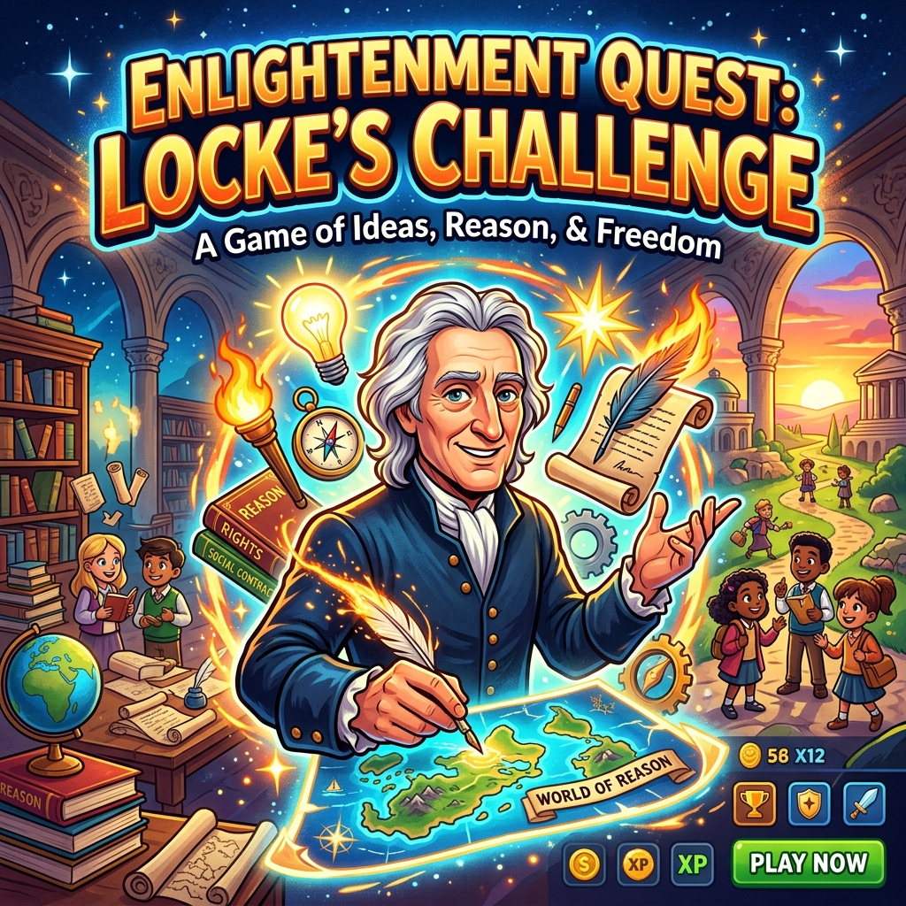

# 沉浸式历史游戏

## 项目简介
本仓库收录了一系列面向马来西亚独立中学二年级历史课程的**沉浸式 web 互动小游戏**。每个游戏围绕一个历史主题，以闯关、选择与即时反馈的方式，让学生在轻松玩耍中巩固历史概念。

## 游戏列表（轮播展示）
- **启蒙运动闯关游戏‑文明重启** – 通过四个关卡体验启蒙思想家（卢梭、孟德斯鸠、亚当·斯密、约翰·洛克）的核心概念。点击下方 **开始游戏** 进入。
- （后续可在 `games.html` 中继续添加其他小游戏卡片）

## 启蒙运动闯关游戏‑文明重启 **玩法说明**
1. 每一关呈现一个情境并给出三个决策选项。
2. 选择后会立即看到结果反馈（成功/失败）以及对应的**勋章**解锁。
3. 成功解锁后进入下一关，全部关卡完成后出现 **胜利页面**。
4. 游戏配有背景音乐（音量滑块控制），鼠标悬停/点击均有音效，题目会通过系统语音朗读（中文普通话）。
5. 第四关引入 **约翰·洛克** 的自然权利理论，玩家需决定是否采用私有财产制度。

## 教学说明（适用于马来西亚独立中学二年级历史）
- **目标**：帮助学生理解启蒙时代的核心思想及其对现代政治制度的影响。
- **使用方式**：课堂上投影或让学生个人设备打开 `games.html`，教师可先演示一遍，再让学生自行挑战，每完成一关可在课堂讨论中简要回顾对应的历史概念。
- **评估**：通过勋章解锁情况了解学生对概念的掌握程度，亦可让学生写下每个思想家的关键主张作为作业。

---

> **注意**：若要在本地预览，请使用任意现代浏览器打开 `games.html`。
